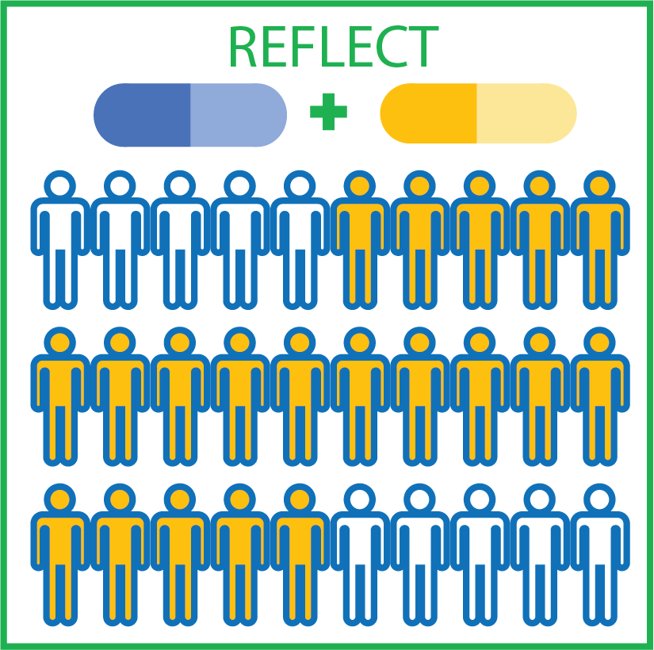

<!-- README.md is generated from README.Rmd. Please edit that file -->

```{r, include = FALSE}
knitr::opts_chunk$set(
  collapse = TRUE,
  comment = "#>",
  fig.path = "man/figures/README-",
  out.width = "100%"
)
options(tibble.print_min = 5, tibble.print_max = 5)
```

# REFLECT <a href='https://bioinformatics.mdanderson.org/reflect/'></a>

## Overview

REFLECT (REcurrent Features LEveraged for Combination Therapy) is to accelerate discovery of combination therapies tailored to multi-omic profiles of cancer patient cohorts with matching oncogenic features. 

REFLECT identifies co-actionable, co-occurring oncogenic alterations that are recurrent within patient cohorts using genomic, transcriptomic and phosphoproteomic data.

The REFLECT website (https://bioinformatics.mdanderson.org/reflect/) provides co-occurrence analyses of ~200 patient cohorts each identified by a potentially actionable aberration.

The reflect package provides a set of functions that runs the reflect pipeline:

* `get_best_wbound()` gets the optimal tunning parameter that maximizes gap statistic.
* `sparse_hclust()` performs a sparse hierarchical clustering.
* `get_recur_pval()` gets recurrence p values based on clustered matrix.
* `get_recur_actionable_features()` gets recurrent and actionable features.
* `get_coaltered_targets()` gets combination targets based on stratification biomarker and REFLECT-selected features.
* `reflect_pipeline()` runs an end-to-end REFLECT pipeline.
* `reflect_pipeline2()` runs a REFLECT pipeline given a precomputed tunning parameter.

The reflect package also provides a set of functions that plots the results:

* `plot_bar_tumortypes()` plots a bar chart of tumor type distribution.
* `plot_bar_tumortypes_stack_tcga_ccl()` plots a stacked bar chart of tumor types for TCGA and cell line samples.
* `plot_gapstat()` plots a gap statistic profile.
* `plot_bar_weights()` plots a bar chart of feature weights.
* `plot_heatmap()` plot a heatmap with covariate bars of feature weights and sample types.

You can learn more about them in `vignette("reflect")`. 

## Installation

reflect will be available from Bioconductor, you can install it by:
```{r, eval = FALSE}
if (!requireNamespace("BiocManager", quietly=TRUE))
    install.packages("BiocManager")
BiocManager::install("reflect")
```

To use the latest development version, you can install reflect from GitHub:

```{r, eval = FALSE}
# install.packages("devtools")
devtools::install_github("korkutlab/reflect")
```

## Usage

```{r, message = FALSE}
library(reflect)

# selecting optimal tunning parameter
# this is computationally costly and may take take a long time 
# gapstat_bestwbound <- get_best_wbound(egfr_data$mat_value)
# wbound <- gapstat_bestwbound$best_wbound

# run a REFLECT pipeline given a precomputed tunning parameter
wbound <- 2.0
res <- reflect_pipeline2(wbound, 
                         egfr_data$mat_value, 
                         egfr_data$df_sample, 
                         egfr_data$df_feature)
```

## Citation
Li X., et al. (2020) Precision combination therapies from recurrent oncogenic co-alterations. doi: https://doi.org/10.1101/2020.06.03.132514
