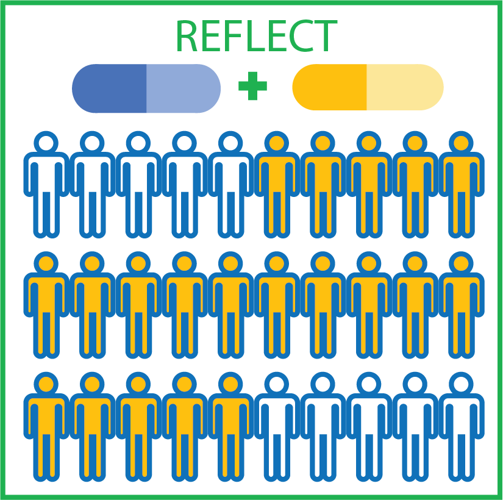

<!-- README.md is generated from README.Rmd. Please edit that file -->

# REFLECT <a href='https://bioinformatics.mdanderson.org/reflect/'></a>

## Overview

REFLECT (REcurrent Features LEveraged for Combination Therapy) is a scalable and user-friendly bioinformatics tool to accelerate drug discovery and clinical translation that will result in real patient benefit. REFLECT identifies co-actionable, co-occurring oncogenic alterations that are recurrent within patient cohorts. REFLECT aims to enable researchers and clinicians to develop more effective targeted therapy combinations and better select benefiting patient cohorts in preclinical and clinical settings.

The REFLECT website (<https://bioinformatics.mdanderson.org/reflect/>)
provides co-occurrence analyses of \~200 patient cohorts each identified
by a potentially actionable aberration.

The reflect package provides a set of functions that runs the reflect
pipeline:

  - `get_best_wbound()` gets the optimal tunning parameter that
    maximizes gap statistic.
  - `sparse_hclust()` performs a sparse hierarchical clustering.
  - `get_recur_pval()` gets recurrence p values based on clustered
    matrix.
  - `get_recur_actionable_features()` gets recurrent and actionable
    features.
  - `get_coaltered_targets()` gets combination targets based on
    stratification biomarker and REFLECT-selected features.
  - `reflect_pipeline()` runs an end-to-end REFLECT pipeline.
  - `reflect_pipeline2()` runs a REFLECT pipeline given a precomputed
    tunning parameter.

The reflect package also provides a set of functions that plots the
results:

  - `plot_bar_tumortypes()` plots a bar chart of tumor type
    distribution.
  - `plot_bar_tumortypes_stack_tcga_ccl()` plots a stacked bar chart of
    tumor types for TCGA and cell line samples.
  - `plot_gapstat()` plots a gap statistic profile.
  - `plot_bar_weights()` plots a bar chart of feature weights.
  - `plot_heatmap()` plot a heatmap with covariate bars of feature
    weights and sample types.

You can learn more about them in `vignette("reflect")`.

## Installation

<!-- reflect will be available from Bioconductor, you can install it by: -->

<!-- ```{r, eval = FALSE} -->

<!-- if (!requireNamespace("BiocManager", quietly=TRUE)) -->

<!--     install.packages("BiocManager") -->

<!-- BiocManager::install("reflect") -->

<!-- ``` -->

To use the latest development version, you can install reflect from
GitHub:

``` r
# install.packages("devtools")
devtools::install_github("korkutlab/reflect")
```

## Usage

``` r
library(reflect)

# selecting optimal tunning parameter
# this is computationally costly and may take take a long time 
# gapstat_bestwbound <- get_best_wbound(egfr_data$mat_value)
# wbound <- gapstat_bestwbound$best_wbound

# run a REFLECT pipeline given a precomputed tunning parameter
wbound <- 2.0
res <- reflect_pipeline2(wbound, 
                         egfr_data$mat_value, 
                         egfr_data$df_sample, 
                         egfr_data$df_feature)
#> 123456
```

## Citation

Li X., et al. (2020) Precision combination therapies from recurrent
oncogenic co-alterations. doi:
<https://doi.org/10.1101/2020.06.03.132514>
